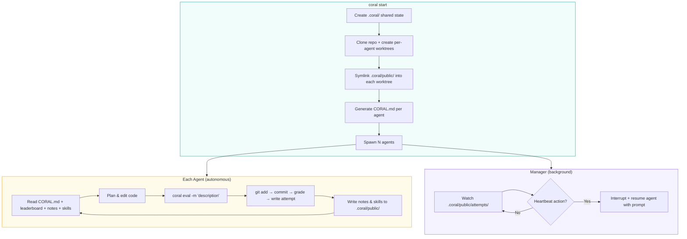

<div align="center">


### **Spawn Agents. Share Knowledge. Optimize Forever.**

[](LICENSE)
[](https://python.org)
[](https://docs.astral.sh/uv/)

**English** | [中文](README_CN.md)

An organization of **autonomous AI agents** that
run experiments, share knowledge, and loop perpetually for better and better solutions.

</div>

<p align="center">
<a href="#demo">Demo</a> · <a href="#installation">Installation</a> · <a href="#usage">Usage</a> · <a href="#how-it-works">How It Works</a> · <a href="#quick-start">Quick Start</a> · <a href="#cli-reference">CLI Reference</a> · <a href="#examples">Examples</a> · <a href="#license">License</a>
</p>


## Demo


[https://github.com/user-attachments/assets/9d63c587-3585-4181-ba75-6a101eebaed8](https://github.com/user-attachments/assets/9d63c587-3585-4181-ba75-6a101eebaed8)

## Installation

```bash
git clone https://github.com/Human-Agent-Society/CORAL.git
cd CORAL
# install uv from https://github.com/astral-sh/uv
uv sync                   # (optionally add --extra ui to include dashboard dependencies)
```

## Usage

### 🚀 One Config. N Agents. Break the SOTA.

```bash
uv run coral start --config examples/kernel_builder/task.yaml
```

### ⏹️ Stop and Resume Anytime.

```bash
uv run coral stop                                      # stop anytime
uv run coral resume                                    # pick up where you left off
```

### 📊 Visualize Everything While It Runs.

```bash
uv run coral ui                                        # open the web dashboard
```

## How It Works



<div align="center">

<div style="width:920px;max-width:100%;font-family:'Inter',-apple-system,sans-serif;color:#3c4043;text-align:left;">

  <!-- Top: User / Developer -->
  <div style="background:#f0faf4;border-radius:16px 16px 0 0;padding:28px 40px 24px;text-align:center;">
    <div style="font-size:18px;font-weight:600;color:#1a1a1a;margin-bottom:20px;">
      <span style="display:inline-block;width:32px;height:32px;border:2px solid #5f6368;border-radius:50%;text-align:center;line-height:28px;font-size:16px;margin-right:8px;vertical-align:middle;">👤</span> User / Developer
    </div>
    <table width="100%"><tr>
      <td align="center" style="font-size:13px;color:#5f6368;">Task config<br>YAML<br><span style="color:#4285f4;font-size:20px;">↓</span></td>
      <td align="center" style="font-size:13px;color:#5f6368;">Target<br>repository<br><span style="color:#ea4335;font-size:20px;">↓</span></td>
      <td align="center" style="font-size:13px;color:#5f6368;">Grader<br>function<br><span style="color:#f9ab00;font-size:20px;">↓</span></td>
      <td align="center" style="font-size:13px;color:#5f6368;">Agent count<br>&amp; sharing config<br><span style="color:#34a853;font-size:20px;">↓</span></td>
    </tr></table>
  </div>

  <!-- Mid: Component boxes -->
  <div style="background:#eef3fc;padding:28px 40px 8px;">
    <table width="100%"><tr>
      <td align="center" width="22%"><div style="border:2px dashed #4285f4;border-radius:12px;padding:16px 8px;background:#fff;"><div style="font-size:32px;">🌿</div><div style="font-size:13px;font-weight:600;color:#4285f4;">Agent<br>Worktrees</div></div></td>
      <td align="center" width="22%"><div style="border:2px dashed #ea4335;border-radius:12px;padding:16px 8px;background:#fff;"><div style="font-size:32px;">🤖</div><div style="font-size:13px;font-weight:600;color:#ea4335;">Claude Code<br>Agents</div></div></td>
      <td align="center" width="22%"><div style="border:2px dashed #f9ab00;border-radius:12px;padding:16px 8px;background:#fff;"><div style="font-size:32px;">⚖️</div><div style="font-size:13px;font-weight:600;color:#f9ab00;">Grader</div></div></td>
      <td align="center" width="22%"><div style="border:2px dashed #34a853;border-radius:12px;padding:16px 8px;background:#fff;"><div style="font-size:32px;">🗄️</div><div style="font-size:13px;font-weight:600;color:#34a853;">.coral/ Hub</div></div></td>
      <td align="center" width="12%"><span style="font-size:20px;">→</span><br><div style="font-size:32px;">🏆</div><div style="font-size:13px;font-weight:600;color:#1a1a1a;">Best<br>solution</div></td>
    </tr></table>
    <table width="100%"><tr>
      <td align="center" width="22%"><span style="color:#4285f4;font-size:18px;">↕</span></td>
      <td align="center" width="22%"><span style="color:#ea4335;font-size:18px;">↕</span></td>
      <td align="center" width="22%"><span style="color:#f9ab00;font-size:18px;">↕</span></td>
      <td align="center" width="22%"><span style="color:#34a853;font-size:18px;">↕</span></td>
      <td width="12%"></td>
    </tr></table>
  </div>

  <!-- Bottom: Agent Loop pseudocode -->
  <div style="background:#eef3fc;padding:0 40px 28px;">
    <div style="border:2px dashed #9aa0a6;border-radius:12px;padding:20px 28px;background:#fff;">
      <div style="font-size:15px;font-weight:700;color:#1a1a1a;text-align:center;margin-bottom:14px;">Autonomous Agent Loop</div>
      <code style="font-size:13.5px;line-height:1.75;">
        coral_md, leaderboard = <span style="color:#34a853;font-weight:500;">hub</span>.read_context()<br>
        plan = <span style="color:#ea4335;font-weight:500;">agent</span>.think(coral_md, leaderboard)<br>
        <span style="color:#ea4335;font-weight:500;">agent</span>.edit_code(<span style="color:#4285f4;font-weight:500;">worktree</span>, plan)<br>
        score, feedback = <span style="color:#f9ab00;font-weight:500;">grader</span>.evaluate(commit)<br>
        <span style="color:#34a853;font-weight:500;">hub</span>.write(attempt, notes, skills)<br>
        <span style="color:#9aa0a6;"># repeat forever — agents share knowledge via .coral/</span>
      </code>
    </div>
  </div>

  <!-- Footer -->
  <div style="background:#eef3fc;border-radius:0 0 16px 16px;padding:12px 40px 28px;text-align:center;">
    <div style="font-size:20px;font-weight:700;color:#1a1a1a;">🪸 CORAL</div>
  </div>

</div>

</div>

Each agent runs in its own git worktree branch. Shared state (attempts, notes, skills) lives in `.coral/public/` and is symlinked into every worktree — agents see each other's work in real time with zero sync overhead. The manager watches for new attempts and can interrupt agents with heartbeat-triggered prompts (e.g. "reflect", "consolidate skills").

| Concept | Description |
|---------|-------------|
| **Agents as optimizers** | Claude Code / Codex / OpenCode subprocesses, each in its own git worktree |
| **Shared state** | `.coral/` directory with attempts, notes, and skills — symlinked into every worktree |
| **Eval loop** | Agents call `uv run coral eval -m "..."` to stage, commit, and grade in one shot |
| **CLI orchestration** | 17+ commands: `start`, `stop`, `status`, `eval`, `log`, `ui`, and more |
| **Web dashboard** | `uv run coral ui` — real-time leaderboard, attempt diffs, agent monitoring |

## Quick Start

### 1. Create a task

Check out the existing tasks in `examples/` for reference, then create your own:

```bash
mkdir -p examples/my-task/{seed,eval}
```

Put any initial files (e.g. `solution.py`) in `seed/` — this is the starting codebase agents will work from. Then point `workspace.repo_path` at it in your config:

```yaml
# examples/my-task/task.yaml
task:
  name: my-task
  description: "Optimize the function in solution.py"

grader:
  type: function
  module: eval.grader

agents:
  count: 2
  model: claude-sonnet-4-20250514
  max_turns: 200

workspace:
  results_dir: "./results"
  repo_path: "./examples/my-task/seed"
```

### 2. Write a grader

```python
# examples/my-task/eval/grader.py
from coral.grader import TaskGrader

class Grader(TaskGrader):
    def evaluate(self) -> float:
        result = self.run_program("solution.py")
        return float(result.stdout.strip())
```

### 3. Launch

```bash
uv run coral start --config examples/my-task/task.yaml
uv run coral ui          # Open web dashboard
uv run coral status      # CLI leaderboard
uv run coral log         # View attempts
uv run coral stop        # Stop all agents
```

## CLI Reference

Click to expand all 17+ commands


| Command                              | Description                         |
| ------------------------------------ | ----------------------------------- |
| `uv run coral init <name>`           | Scaffold a new task                 |
| `uv run coral validate <name>`       | Test the grader                     |
| `uv run coral start -c task.yaml`    | Launch agents                       |
| `uv run coral resume`                | Resume a previous run               |
| `uv run coral stop`                  | Stop all agents                     |
| `uv run coral status`                | Agent health + leaderboard          |
| `uv run coral log`                   | Leaderboard (top 20)                |
| `uv run coral log -n 5 --recent`     | Recent attempts                     |
| `uv run coral log --search "query"`  | Search attempts                     |
| `uv run coral show <hash>`           | Attempt details + diff              |
| `uv run coral notes`                 | Browse shared notes                 |
| `uv run coral skills`                | Browse shared skills                |
| `uv run coral runs`                  | List all runs                       |
| `uv run coral ui`                    | Web dashboard                       |
| `uv run coral eval -m "description"` | Stage, commit, evaluate (agent use) |
| `uv run coral diff`                  | Show uncommitted changes            |
| `uv run coral revert`                | Undo last commit                    |
| `uv run coral checkout <hash>`       | Reset to previous attempt           |
| `uv run coral heartbeat`             | View/modify heartbeat actions       |


## Architecture

Click to expand

```
coral/
├── types.py             # Task, Score, ScoreBundle, Attempt
├── config.py            # YAML-based CoralConfig
├── agent/
│   ├── manager.py       # Multi-agent lifecycle
│   └── runtime.py       # Claude Code / Codex / OpenCode subprocess
├── workspace/
│   └── setup.py         # Worktree creation, hooks, symlinks
├── grader/
│   ├── protocol.py      # GraderInterface protocol
│   ├── base.py          # BaseGrader (helpers: _make_score, _make_bundle)
│   ├── task_grader.py   # TaskGrader for task-specific graders
│   ├── loader.py        # Grader discovery and loading
│   └── builtin/
│       └── function_grader.py
├── hub/
│   ├── attempts.py      # Attempt CRUD + leaderboard + search
│   ├── notes.py         # Markdown notes with YAML frontmatter
│   └── skills.py        # Skill directories with SKILL.md
├── hooks/
│   └── post_commit.py   # Eval-on-commit implementation
├── template/
│   └── coral_md.py      # CORAL.md generator
├── web/                 # Starlette + React dashboard
└── cli/                 # 17 commands across 5 modules
```

## Examples

Ready-to-run task configurations in `examples/`:


| Task                       | Domain       | Description                                                 |
| -------------------------- | ------------ | ----------------------------------------------------------- |
| **circle_packing**         | Optimization | Pack 26 circles into a unit square to maximize sum of radii |
| **erdos**                  | Mathematics  | Solve a math conjecture                                     |
| **kernel_builder**         | Systems      | VLIW SIMD kernel optimization                               |
| **kernel_engineering**     | Systems      | GPU kernel optimization                                     |
| **mnist**                  | ML           | Handwritten digit classification                            |
| **spaceship_titanic**      | ML           | Kaggle competition                                          |
| **stanford_covid_vaccine** | Bio/ML       | mRNA degradation prediction                                 |


## Development


| Component       | Tech Stack                         |
| --------------- | ---------------------------------- |
| Language        | Python 3.11+                       |
| Build           | Hatchling                          |
| Package manager | uv                                 |
| Web backend     | Starlette                          |
| Web frontend    | React + TypeScript (Vite)          |
| Core dependency | PyYAML                             |
| Optional        | swebench, datasets, docker, harbor |


```bash
# Install dev dependencies
uv sync --extra dev

# Run tests
uv run pytest tests/ -v

# Lint & format
uv run ruff check .
uv run ruff format .
```

## License

MIT — see [LICENSE](LICENSE) for details.