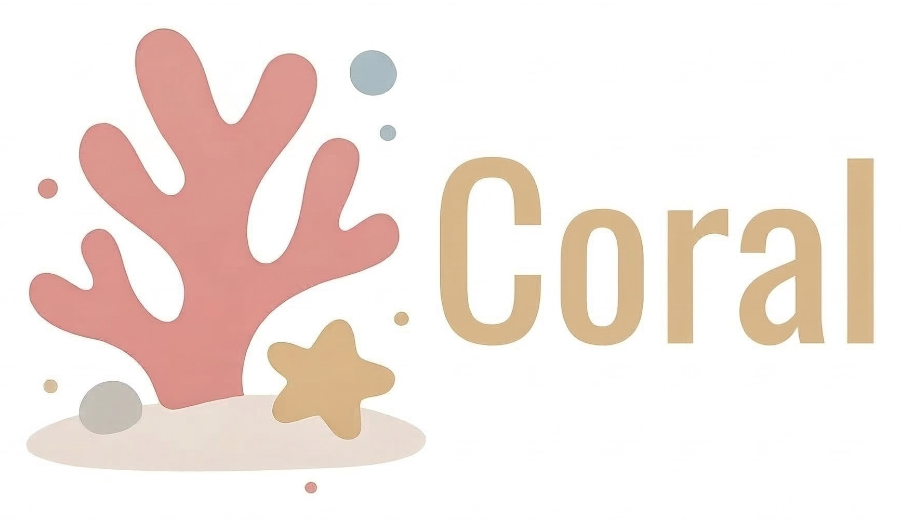
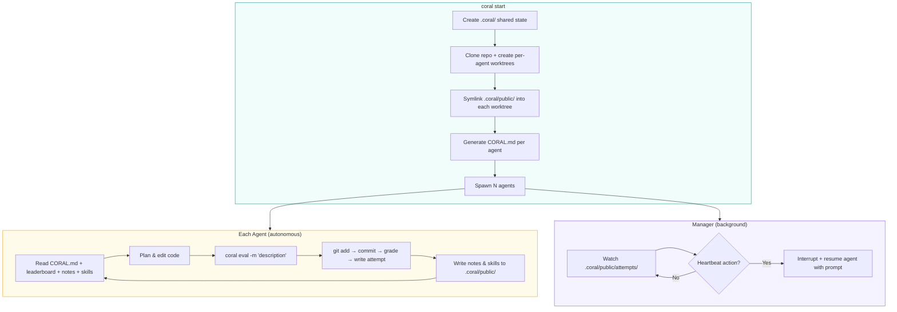

<div align="center">



### **Spawn Agents. Share Knowledge. Optimize Forever.**

[](LICENSE)
[](https://python.org)
[](https://docs.astral.sh/uv/)

**English** | [中文](README_CN.md)

An organization of **autonomous AI agents** that
run experiments, share knowledge, and loop until they converge on the best solution.

</div>

<p align="center">
<a href="#installation">Installation</a> · <a href="#usage">Usage</a> · <a href="#how-it-works">How It Works</a> · <a href="#key-concepts">Key Concepts</a> · <a href="#quick-start">Quick Start</a> · <a href="#cli-reference">CLI Reference</a> · <a href="#examples">Examples</a> · <a href="#license">License</a>
</p>

## Installation

```bash
git clone https://github.com/Human-Agent-Society/CORAL.git
cd CORAL
# install uv from https://github.com/astral-sh/uv
uv sync                   # (optionally add --extra ui to include dashboard dependencies)
```

## Usage

### 🚀 One Config. N Agents. Break the SOTA.

```bash
uv run coral start --config task.yaml
```

### ⏹️ Stop and Resume Anytime.

```bash
uv run coral stop                                      # stop anytime
uv run coral resume                                    # pick up where you left off
```

### 📊 Visualize Everything.

```bash
uv run coral ui                                        # open the web dashboard
```

## How It Works



Each agent runs in its own git worktree branch. Shared state (attempts, notes, skills) lives in `.coral/public/` and is symlinked into every worktree — agents see each other's work in real time with zero sync overhead. The manager watches for new attempts and can interrupt agents with heartbeat-triggered prompts (e.g. "reflect", "consolidate skills").

## Key Concepts


| Concept                  | Description                                                                          |
| ------------------------ | ------------------------------------------------------------------------------------ |
| **Agents as optimizers** | Claude Code / Codex / OpenCode subprocesses, each in its own git worktree            |
| **Shared state**         | `.coral/` directory with attempts, notes, and skills — symlinked into every worktree |
| **Eval loop**            | Agents call `uv run coral eval -m "..."` to stage, commit, and grade in one shot     |
| **CLI orchestration**    | 17+ commands: `start`, `stop`, `status`, `eval`, `log`, `ui`, and more               |
| **Web dashboard**        | `uv run coral ui` — real-time leaderboard, attempt diffs, agent monitoring           |


## Quick Start

### 1. Create a task

```yaml
# my-task/task.yaml
task:
  name: my-task
  description: "Optimize the function in solution.py"

grader:
  type: function
  module: eval.grader

agents:
  count: 2
  model: claude-sonnet-4-20250514
  max_turns: 200
```

### 2. Write a grader

```python
# my-task/eval/grader.py
from coral.grader import TaskGrader

class Grader(TaskGrader):
    def evaluate(self) -> float:
        result = self.run_program("solution.py")
        return float(result.stdout.strip())
```

### 3. Launch

```bash
uv run coral start --config my-task/task.yaml
uv run coral ui          # Open web dashboard
uv run coral status      # CLI leaderboard
uv run coral log         # View attempts
uv run coral stop        # Stop all agents
```

## CLI Reference

Click to expand all 17+ commands


| Command                              | Description                         |
| ------------------------------------ | ----------------------------------- |
| `uv run coral init <name>`           | Scaffold a new task                 |
| `uv run coral validate <name>`       | Test the grader                     |
| `uv run coral start -c task.yaml`    | Launch agents                       |
| `uv run coral resume`                | Resume a previous run               |
| `uv run coral stop`                  | Stop all agents                     |
| `uv run coral status`                | Agent health + leaderboard          |
| `uv run coral log`                   | Leaderboard (top 20)                |
| `uv run coral log -n 5 --recent`     | Recent attempts                     |
| `uv run coral log --search "query"`  | Search attempts                     |
| `uv run coral show <hash>`           | Attempt details + diff              |
| `uv run coral notes`                 | Browse shared notes                 |
| `uv run coral skills`                | Browse shared skills                |
| `uv run coral runs`                  | List all runs                       |
| `uv run coral ui`                    | Web dashboard                       |
| `uv run coral eval -m "description"` | Stage, commit, evaluate (agent use) |
| `uv run coral diff`                  | Show uncommitted changes            |
| `uv run coral revert`                | Undo last commit                    |
| `uv run coral checkout <hash>`       | Reset to previous attempt           |
| `uv run coral heartbeat`             | View/modify heartbeat actions       |


## Grading System

Click to expand

Graders implement the `GraderInterface` protocol:

```python
class GraderInterface(Protocol):
    async def grade(self, codebase_path: str, tasks: list[Task], **kwargs) -> ScoreBundle: ...
```

Built-in graders:


| Grader             | Usage                                                                                               |
| ------------------ | --------------------------------------------------------------------------------------------------- |
| **TaskGrader**     | Base class for task-specific graders — provides `run_program`, `read_eval`, `score`, `fail` helpers |
| **FunctionGrader** | Wrap any `(codebase_path, tasks) -> Score                                                           |


## Architecture

Click to expand

```
coral/
├── types.py             # Task, Score, ScoreBundle, Attempt
├── config.py            # YAML-based CoralConfig
├── agent/
│   ├── manager.py       # Multi-agent lifecycle
│   └── runtime.py       # Claude Code / Codex / OpenCode subprocess
├── workspace/
│   └── setup.py         # Worktree creation, hooks, symlinks
├── grader/
│   ├── protocol.py      # GraderInterface protocol
│   ├── base.py          # BaseGrader (helpers: _make_score, _make_bundle)
│   ├── task_grader.py   # TaskGrader for task-specific graders
│   ├── loader.py        # Grader discovery and loading
│   └── builtin/
│       └── function_grader.py
├── hub/
│   ├── attempts.py      # Attempt CRUD + leaderboard + search
│   ├── notes.py         # Markdown notes with YAML frontmatter
│   └── skills.py        # Skill directories with SKILL.md
├── hooks/
│   └── post_commit.py   # Eval-on-commit implementation
├── template/
│   └── coral_md.py      # CORAL.md generator
├── web/                 # Starlette + React dashboard
└── cli/                 # 17 commands across 5 modules
```

## Examples

Ready-to-run task configurations in `examples/`:


| Task                       | Domain       | Description                                                 |
| -------------------------- | ------------ | ----------------------------------------------------------- |
| **circle_packing**         | Optimization | Pack 26 circles into a unit square to maximize sum of radii |
| **erdos**                  | Mathematics  | Solve a math conjecture                                     |
| **kernel_builder**         | Systems      | VLIW SIMD kernel optimization                               |
| **kernel_engineering**     | Systems      | GPU kernel optimization                                     |
| **mnist**                  | ML           | Handwritten digit classification                            |
| **spaceship_titanic**      | ML           | Kaggle competition                                          |
| **stanford_covid_vaccine** | Bio/ML       | mRNA degradation prediction                                 |


## Development

Click to expand


| Component       | Tech Stack                         |
| --------------- | ---------------------------------- |
| Language        | Python 3.11+                       |
| Build           | Hatchling                          |
| Package manager | uv                                 |
| Web backend     | Starlette                          |
| Web frontend    | React + TypeScript (Vite)          |
| Core dependency | PyYAML                             |
| Optional        | swebench, datasets, docker, harbor |


```bash
# Install dev dependencies
uv sync --extra dev

# Run tests
uv run pytest tests/ -v

# Lint & format
uv run ruff check .
uv run ruff format .
```

## License

MIT — see [LICENSE](LICENSE) for details.