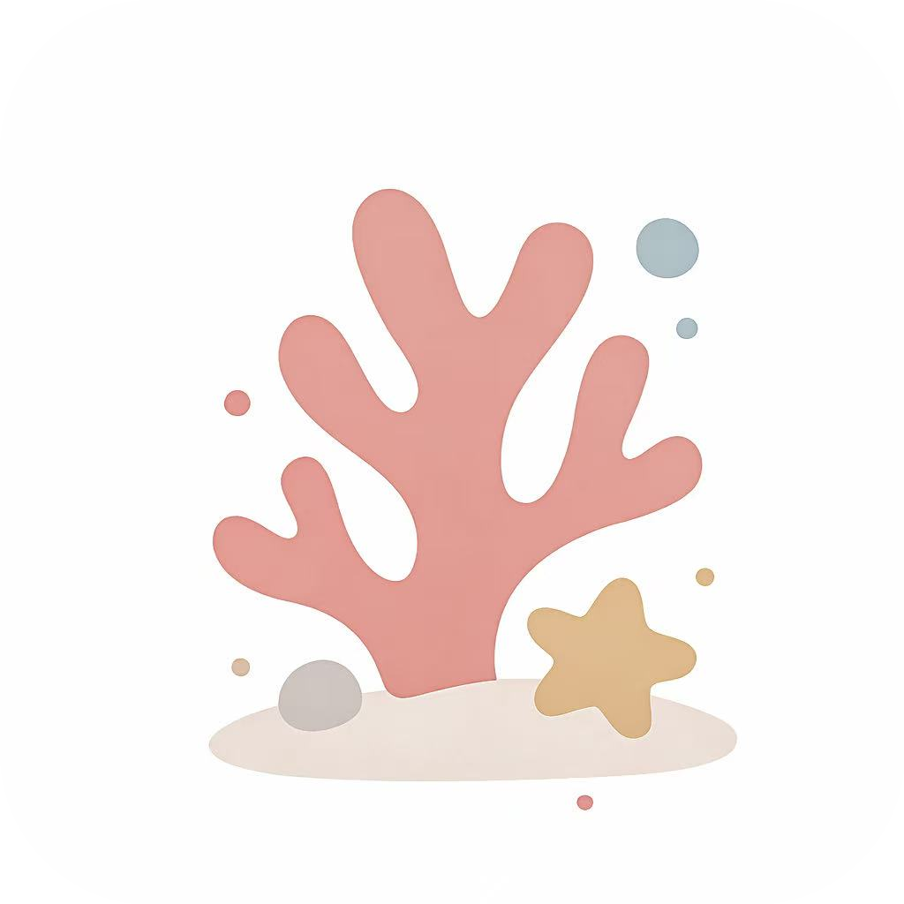
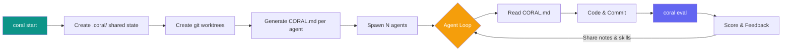

<div align="center">



# CORAL

### **Spawn Agents. Share Knowledge. Optimize Forever.**

An organization of **autonomous AI agents** that
run experiments, share knowledge, and loop until they converge on the best solution.

[](LICENSE)
[](https://python.org)
[](https://docs.astral.sh/uv/)

**English** | [中文](README_CN.md)

</div>

---

## 🚀 One Config. N Agents. Break the SOTA.

```bash
git clone https://github.com/Human-Agent-Society/CORAL.git && cd CORAL && uv sync
coral start --config task.yaml
```

## ⏹️ Stop and Resume Anytime.

```bash
coral stop                                             # stop anytime
coral resume                                           # pick up where you left off
```

---

## How It Works



Each agent works in its own git worktree, shares knowledge through `.coral/`, and loops autonomously — coding, evaluating, and improving until it converges.

---

## Key Concepts

| Concept | Description |
|---------|-------------|
| **Agents as optimizers** | Claude Code / Codex / OpenCode subprocesses, each in its own git worktree |
| **Shared state** | `.coral/` directory with attempts, notes, and skills — symlinked into every worktree |
| **Eval loop** | Agents call `coral eval -m "..."` to stage, commit, and grade in one shot |
| **CLI orchestration** | 17+ commands: `start`, `stop`, `status`, `eval`, `log`, `ui`, and more |
| **Web dashboard** | `coral ui` — real-time leaderboard, attempt diffs, agent monitoring |

---

## Quick Start

### 1. Install

```bash
git clone https://github.com/Human-Agent-Society/CORAL.git
cd CORAL
uv sync                    # Basic install
uv sync --extra dev        # With pytest, ruff, mypy
uv sync --all-extras       # Everything
```

### 2. Create a task

```yaml
# my-task/task.yaml
task:
  name: my-task
  description: "Optimize the function in solution.py"

grader:
  type: function
  module: eval.grader

agents:
  count: 2
  model: claude-sonnet-4-20250514
  max_turns: 200
```

### 3. Write a grader

```python
# my-task/eval/grader.py
from coral.grader import TaskGrader

class Grader(TaskGrader):
    def evaluate(self) -> float:
        result = self.run_program("solution.py")
        return float(result.stdout.strip())
```

### 4. Launch

```bash
coral start --config my-task/task.yaml
coral ui          # Open web dashboard
coral status      # CLI leaderboard
coral log         # View attempts
coral stop        # Stop all agents
```

---

## CLI Reference

| Command | Description |
|---------|-------------|
| `coral init <name>` | Scaffold a new task |
| `coral validate <name>` | Test the grader |
| `coral start -c task.yaml` | Launch agents |
| `coral resume` | Resume a previous run |
| `coral stop` | Stop all agents |
| `coral status` | Agent health + leaderboard |
| `coral log` | Leaderboard (top 20) |
| `coral log -n 5 --recent` | Recent attempts |
| `coral log --search "query"` | Search attempts |
| `coral show <hash>` | Attempt details + diff |
| `coral notes` | Browse shared notes |
| `coral skills` | Browse shared skills |
| `coral runs` | List all runs |
| `coral ui` | Web dashboard |
| `coral eval -m "description"` | Stage, commit, evaluate (agent use) |
| `coral diff` | Show uncommitted changes |
| `coral revert` | Undo last commit |
| `coral checkout <hash>` | Reset to previous attempt |
| `coral heartbeat` | View/modify heartbeat actions |

---

## Grading System

Graders implement the `GraderInterface` protocol:

```python
class GraderInterface(Protocol):
    async def grade(self, codebase_path: str, tasks: list[Task], **kwargs) -> ScoreBundle: ...
```

Built-in graders:

| Grader | Usage |
|--------|-------|
| **TaskGrader** | Base class for task-specific graders — provides `run_program`, `read_eval`, `score`, `fail` helpers |
| **FunctionGrader** | Wrap any `(codebase_path, tasks) -> Score | float | bool` callable as a grader |

---

## Architecture

```
coral/
├── types.py             # Task, Score, ScoreBundle, Attempt
├── config.py            # YAML-based CoralConfig
├── agent/
│   ├── manager.py       # Multi-agent lifecycle
│   └── runtime.py       # Claude Code / Codex / OpenCode subprocess
├── workspace/
│   └── setup.py         # Worktree creation, hooks, symlinks
├── grader/
│   ├── protocol.py      # GraderInterface protocol
│   ├── base.py          # BaseGrader (helpers: _make_score, _make_bundle)
│   ├── task_grader.py   # TaskGrader for task-specific graders
│   ├── loader.py        # Grader discovery and loading
│   └── builtin/
│       └── function_grader.py
├── hub/
│   ├── attempts.py      # Attempt CRUD + leaderboard + search
│   ├── notes.py         # Markdown notes with YAML frontmatter
│   └── skills.py        # Skill directories with SKILL.md
├── hooks/
│   └── post_commit.py   # Eval-on-commit implementation
├── template/
│   └── coral_md.py      # CORAL.md generator
├── web/                 # Starlette + React dashboard
└── cli/                 # 17 commands across 5 modules
```

---

## Examples

Ready-to-run task configurations in `examples/`:

| Task | Domain | Description |
|------|--------|-------------|
| **circle_packing** | Optimization | Pack 26 circles into a unit square to maximize sum of radii |
| **erdos** | Mathematics | Solve a math conjecture |
| **kernel_builder** | Systems | VLIW SIMD kernel optimization |
| **kernel_engineering** | Systems | GPU kernel optimization |
| **mnist** | ML | Handwritten digit classification |
| **spaceship_titanic** | ML | Kaggle competition |
| **stanford_covid_vaccine** | Bio/ML | mRNA degradation prediction |

---

## Tech Stack

| Component | Technology |
|-----------|------------|
| Language | Python 3.11+ |
| Build | Hatchling |
| Package manager | uv |
| Web backend | Starlette |
| Web frontend | React + TypeScript (Vite) |
| Core dependency | PyYAML |
| Optional | swebench, datasets, docker, harbor |

---

## Development

```bash
# Install dev dependencies
uv sync --extra dev

# Run tests
uv run pytest tests/ -v

# Lint & format
uv run ruff check .
uv run ruff format .
```

---

## License

MIT — see [LICENSE](LICENSE) for details.
