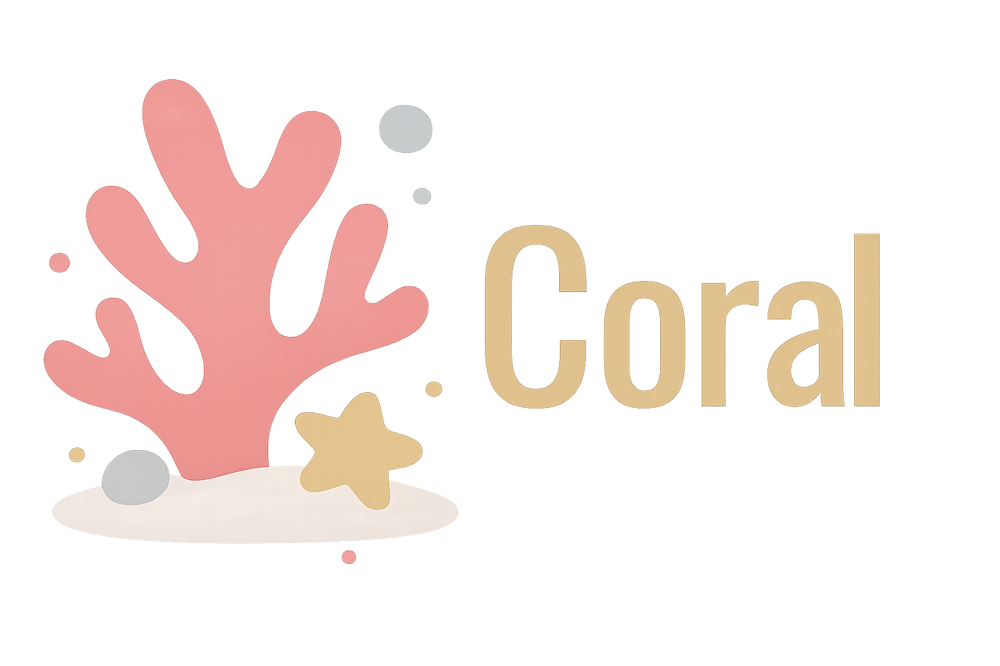
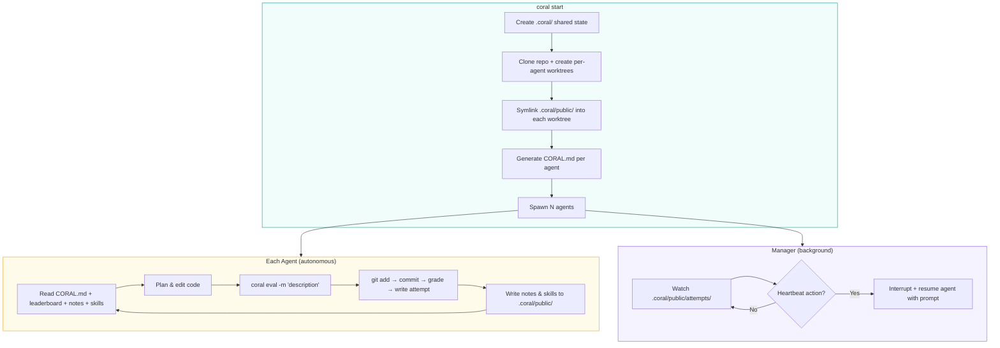
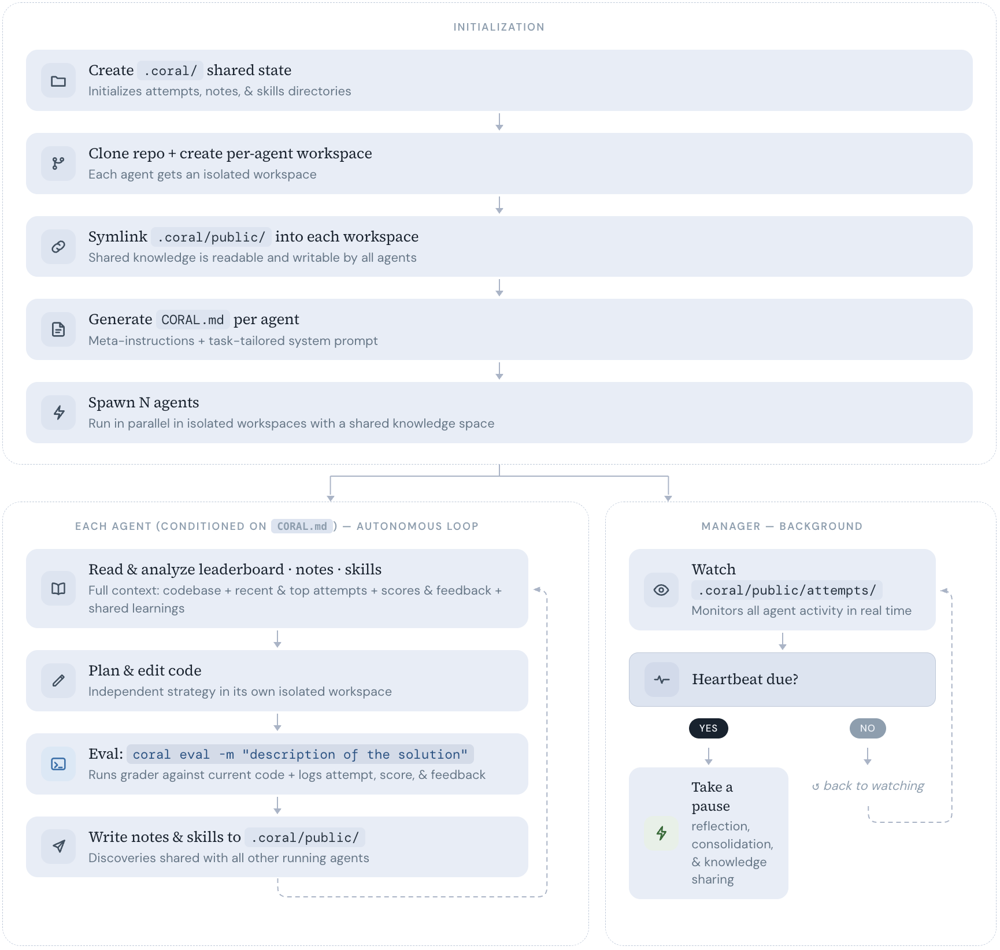

<div align="center">



### **Spawn Agents. Share Knowledge. Optimize Forever.**

<p>
  
  &nbsp;&nbsp;&nbsp;&nbsp;&nbsp;&nbsp;
  
  &nbsp;&nbsp;&nbsp;&nbsp;&nbsp;&nbsp;
  
</p>

[](https://human-agent-society.github.io/CORAL/)
[](LICENSE)
[](https://python.org)
[](https://docs.astral.sh/uv/)

**English** | [中文](assets/README_CN.md)

</div>

**Coral** is an infrastructure for building organizations of **autonomous AI agents** that run experiments, share knowledge, and continuously improve solutions. Give it a codebase and a grading script, and your agents handle the rest — no tedious hyperparameter tuning required. Natively integrated with Claude Code, OpenCode, Codex, and other major coding agents.

Want self-improving AI without the configuration overhead? Try Coral.

<p align="center">
<a href="#installation">Installation</a> · <a href="#supported-agents">Supported Agents</a> · <a href="#usage">Usage</a> · <a href="#how-it-works">How It Works</a> · <a href="#quick-start">Quick Start</a> · <a href="#cli-reference">CLI Reference</a> · <a href="#examples">Examples</a> · <a href="#license">License</a>
</p>


[https://github.com/user-attachments/assets/9d63c587-3585-4181-ba75-6a101eebaed8](https://github.com/user-attachments/assets/9d63c587-3585-4181-ba75-6a101eebaed8)

## Installation

```bash
git clone https://github.com/Human-Agent-Society/CORAL.git
cd CORAL
# install uv from https://github.com/astral-sh/uv
uv sync                   # (optionally add --extra ui to include dashboard dependencies)
```

## Supported Agents

Coral works with any coding agent that can run as a subprocess and interact via the terminal. Currently supported:

| Agent | Description |
|-------|-------------|
| [**Claude Code**](https://github.com/anthropics/claude-code) | Anthropic's agentic coding tool — the default and most tested runtime |
| [**Codex**](https://github.com/openai/codex) | OpenAI's open-source coding agent |
| [**OpenCode**](https://github.com/opencode-ai/opencode) | Open-source terminal-based AI coding agent |

> **Important:** Before using Coral, make sure you have fully set up the agent(s) you plan to use:
>
> - **Install the Agent:** Follow the official installation instructions for your agent (e.g., Claude Code, Codex, OpenCode). This may involve installing packages, setting up executables, or configuring scripts.
> - **Authentication:** Login and authenticate your coding agent first to make sure they do not ask for your credentials in CLI mode. Set up any required environment variables, configuration files, or authentication secrets as specified in your agent's documentation.
> - **Set Permissions:** Configure your agent's permission settings via its config file (e.g., `~/.claude/settings.json` for Claude Code) to control which tools, file paths, or actions it is allowed to perform.
>
> *Coral does not handle agent installation or authentication for you. The infrastructure will fail to function if the underlying agent cannot start or is not properly authenticated.*

Set the agent in your task config (refer to <a href="#3-configure-the-task">Configure the task</a>):

```yaml
agents:
  runtime: claude_code   # or "codex" or "opencode"
  count: 3  # how many agents you want to spawn. Beware of your budget :)
```

## Usage

### 🚀 One Config. N Agents. Break the SOTA.

```bash
uv run coral start --config examples/kernel_builder/task.yaml
```

### ⏹️ Stop and Resume Anytime.

```bash
uv run coral stop                                      # stop anytime
uv run coral resume                                    # pick up where you left off
```

### 📊 Visualize Everything While It Runs.

```bash
uv run coral ui                                        # open the web dashboard
```

## How It Works



<p align="center">
  
</p>

Each agent runs in its own git worktree branch. Shared state (attempts, notes, skills) lives in `.coral/public/` and is symlinked into every worktree — agents see each other's work in real time with zero sync overhead. The manager watches for new attempts and can interrupt agents with heartbeat-triggered prompts (e.g. "reflect", "consolidate skills").

| Concept | Description |
|---------|-------------|
| **Agents as optimizers** | Claude Code / Codex / OpenCode subprocesses, each in its own git worktree |
| **Shared state** | `.coral/` directory with attempts, notes, and skills — symlinked into every worktree |
| **Eval loop** | Agents call `uv run coral eval -m "..."` to stage, commit, and grade in one shot |
| **CLI orchestration** | 17+ commands: `start`, `stop`, `status`, `eval`, `log`, `ui`, and more |
| **Web dashboard** | `uv run coral ui` — real-time leaderboard, attempt diffs, agent monitoring |

## Quick Start

Let's walk through a complete example: agents compete to solve a **10-city Traveling Salesman Problem**.

### 1. Write a seed codebase

The seed is the starting code that agents will iterate on. Create the directory and a naive initial solution:

```bash
mkdir -p examples/tsp/{seed,eval}
```

```python
# examples/tsp/seed/solution.py
CITIES = [
    (0.19, 0.44), (0.87, 0.23), (0.52, 0.91), (0.34, 0.12), (0.78, 0.65),
    (0.08, 0.73), (0.63, 0.38), (0.41, 0.56), (0.95, 0.82), (0.27, 0.05),
]

# Naive: visit cities in index order (0, 1, 2, ..., 9)
for i in range(len(CITIES)):
    print(i)
```

### 2. Write a grader

Subclass `TaskGrader` and implement `evaluate()`. The base class provides two helpers: `self.run_program(filename)` which runs a file from the agent's codebase in a subprocess and returns a `CompletedProcess` (with `.stdout`, `.stderr`, `.returncode`), and `self.fail(reason)` which records the failure and returns `-inf` as the score:

```python
# examples/tsp/eval/grader.py
import math
from coral.grader import TaskGrader

CITIES = [
    (0.19, 0.44), (0.87, 0.23), (0.52, 0.91), (0.34, 0.12), (0.78, 0.65),
    (0.08, 0.73), (0.63, 0.38), (0.41, 0.56), (0.95, 0.82), (0.27, 0.05),
]

class Grader(TaskGrader):
    def evaluate(self) -> float:
        try:
            result = self.run_program("solution.py")  # runs solution.py, returns CompletedProcess
            order = [int(x) for x in result.stdout.strip().split("\n")]
            assert sorted(order) == list(range(len(CITIES)))
            dist = sum(
                math.dist(CITIES[order[i]], CITIES[order[(i + 1) % len(order)]])
                for i in range(len(order))
            )
            return -dist  # shorter tour = higher score
        except Exception as e:
            return self.fail(str(e))  # records failure and returns -inf score
```

The naive seed tour scores about `-4.98`. Agents will try nearest-neighbor, 2-opt, simulated annealing, etc. to find shorter routes.

### 3. Configure the task

Point the config at your seed codebase and grader:

```yaml
# examples/tsp/task.yaml
task:
  name: tsp
  description: |
    Find the shortest round-trip tour through 10 cities. The coordinates
    of the 10 cities is provided in `solution.py`. DO NOT MODIFY the `CITIES` coordinates!

    solution.py must print 10 integers (0–9) to stdout, one per line,
    representing the visit order. Each city must appear exactly once.
    
    The grader computes the total Euclidean round-trip distance
    and returns -distance as the score (shorter = higher).

grader:
  type: function
  module: eval.grader

agents:
  count: 2
  runtime: claude_code  # or opencode, codex
  model: claude-sonnet-4-20250514
  max_turns: 200

workspace:
  results_dir: "./results"
  repo_path: "./examples/tsp/seed"
```

### 4. Launch

```bash
uv run coral start --config examples/tsp/task.yaml
uv run coral ui          # Open web dashboard
uv run coral status      # CLI leaderboard
uv run coral log         # View attempts
uv run coral stop        # Stop all agents
```

## CLI Reference

Click to expand all 17+ commands


| Command                              | Description                         |
| ------------------------------------ | ----------------------------------- |
| `uv run coral init <name>`           | Scaffold a new task                 |
| `uv run coral validate <name>`       | Test the grader                     |
| `uv run coral start -c task.yaml`    | Launch agents                       |
| `uv run coral resume`                | Resume a previous run               |
| `uv run coral stop`                  | Stop all agents                     |
| `uv run coral status`                | Agent health + leaderboard          |
| `uv run coral log`                   | Leaderboard (top 20)                |
| `uv run coral log -n 5 --recent`     | Recent attempts                     |
| `uv run coral log --search "query"`  | Search attempts                     |
| `uv run coral show <hash>`           | Attempt details + diff              |
| `uv run coral notes`                 | Browse shared notes                 |
| `uv run coral skills`                | Browse shared skills                |
| `uv run coral runs`                  | List all runs                       |
| `uv run coral ui`                    | Web dashboard                       |
| `uv run coral eval -m "description"` | Stage, commit, evaluate (agent use) |
| `uv run coral diff`                  | Show uncommitted changes            |
| `uv run coral revert`                | Undo last commit                    |
| `uv run coral checkout <hash>`       | Reset to previous attempt           |
| `uv run coral heartbeat`             | View/modify heartbeat actions       |


## Architecture

Click to expand

```
coral/
├── types.py             # Task, Score, ScoreBundle, Attempt
├── config.py            # YAML-based CoralConfig
├── agent/
│   ├── manager.py       # Multi-agent lifecycle
│   └── runtime.py       # Claude Code / Codex / OpenCode subprocess
├── workspace/
│   └── setup.py         # Worktree creation, hooks, symlinks
├── grader/
│   ├── protocol.py      # GraderInterface protocol
│   ├── base.py          # BaseGrader (helpers: _make_score, _make_bundle)
│   ├── task_grader.py   # TaskGrader for task-specific graders
│   ├── loader.py        # Grader discovery and loading
│   └── builtin/
│       └── function_grader.py
├── hub/
│   ├── attempts.py      # Attempt CRUD + leaderboard + search
│   ├── notes.py         # Markdown notes with YAML frontmatter
│   └── skills.py        # Skill directories with SKILL.md
├── hooks/
│   └── post_commit.py   # Eval-on-commit implementation
├── template/
│   └── coral_md.py      # CORAL.md generator
├── web/                 # Starlette + React dashboard
└── cli/                 # 17 commands across 5 modules
```

## Examples

Ready-to-run task configurations in `examples/`:


| Task                       | Domain       | Description                                                 |
| -------------------------- | ------------ | ----------------------------------------------------------- |
| **circle_packing**         | Optimization | Pack 26 circles into a unit square to maximize sum of radii |
| **erdos**                  | Mathematics  | Solve a math conjecture                                     |
| **kernel_builder**         | Systems      | VLIW SIMD kernel optimization                               |
| **kernel_engineering**     | Systems      | GPU kernel optimization                                     |
| **mnist**                  | ML           | Handwritten digit classification                            |
| **spaceship_titanic**      | ML           | Kaggle competition                                          |
| **stanford_covid_vaccine** | Bio/ML       | mRNA degradation prediction                                 |


## Development


| Component       | Tech Stack                         |
| --------------- | ---------------------------------- |
| Language        | Python 3.11+                       |
| Build           | Hatchling                          |
| Package manager | uv                                 |
| Web backend     | Starlette                          |
| Web frontend    | React + TypeScript (Vite)          |
| Core dependency | PyYAML                             |
| Optional        | swebench, datasets, docker, harbor |


```bash
# Install dev dependencies
uv sync --extra dev

# Run tests
uv run pytest tests/ -v

# Lint & format
uv run ruff check .
uv run ruff format .
```

## License

MIT — see [LICENSE](LICENSE) for details.