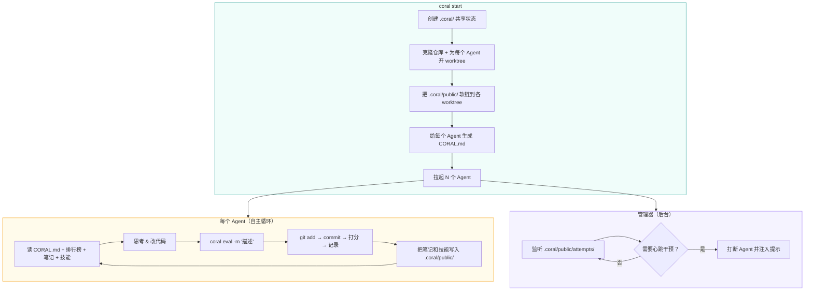

<div align="center">


### **一键启动智能体群组，共享知识，无限进化**

[](LICENSE)
[](https://python.org)
[](https://docs.astral.sh/uv/)

[English](README.md) | **中文**

**自主 AI Agent组织** ——
不断试验、互通有无、持续进化，优化目标。

</div>

<p align="center">
<a href="#演示">演示</a> · <a href="#安装">安装</a> · <a href="#使用">使用</a> · <a href="#工作原理与结构">工作原理</a> · <a href="#快速上手">快速上手</a> · <a href="#cli-命令">CLI 命令</a> · <a href="#示例">示例</a> · <a href="#许可证">许可证</a>
</p>

## 演示

[https://github.com/user-attachments/assets/9d63c587-3585-4181-ba75-6a101eebaed8](https://github.com/user-attachments/assets/9d63c587-3585-4181-ba75-6a101eebaed8)

## 安装

```bash
git clone https://github.com/Human-Agent-Society/CORAL.git
cd CORAL
uv sync
```

## 使用

### 🚀 一份配置生成多个Agents，协作冲击 SOTA。

```bash
uv run coral start --config examples/kernel_builder/task.yaml
```

### ⏹️ 随停随启。

```bash
uv run coral stop                                      # 暂停
uv run coral resume                                    # 继续
```

### 📊 可视化看板，开箱即用。

```bash
uv run coral ui                                        # 打开 Web 看板
```

## 工作原理与结构



每个 Agent 跑在自己的 git worktree 分支里。共享状态（历史记录、笔记、技能）放在 `.coral/public/`，软链到所有 worktree —— 零开销，实时互通。后台管理器盯着新提交，可以通过心跳机制打断 Agent 并注入指令（比如"回顾一下"、"整理技能"）。

| 概念 | 说明 |
|------|------|
| **Agent = 优化器** | Claude Code / Codex / OpenCode 子进程，各占一个 git worktree |
| **共享状态** | `.coral/` 存放历史记录、笔记和技能，软链到每个 worktree |
| **Eval 循环** | Agent 调 `uv run coral eval -m "..."` 一步完成暂存 + 提交 + 打分 |
| **CLI 调度** | 17+ 条命令：`start`、`stop`、`status`、`eval`、`log`、`ui` 等 |
| **Web 看板** | `uv run coral ui` —— 实时排行榜、diff 对比、Agent 监控 |

## 快速上手

以一个完整的例子来演示：多个 Agent 竞争求解 **10 城市旅行商问题（TSP）**。

### 1. 写初始代码

初始代码（seed）是 Agent 迭代优化的起点。创建目录并写一个最简方案：

```bash
mkdir -p examples/tsp/{seed,eval}
```

```python
# examples/tsp/seed/solution.py
CITIES = [
    (0.19, 0.44), (0.87, 0.23), (0.52, 0.91), (0.34, 0.12), (0.78, 0.65),
    (0.08, 0.73), (0.63, 0.38), (0.41, 0.56), (0.95, 0.82), (0.27, 0.05),
]

# 最简方案：按编号顺序访问 (0, 1, 2, ..., 9)
for i in range(len(CITIES)):
    print(i)
```

### 2. 写评分器

继承 `TaskGrader`，实现 `evaluate()` 方法。基类提供 `self.run_program(filename)`，它会在子进程中运行 Agent 代码库里的文件，返回 `CompletedProcess`（含 `.stdout`、`.stderr`、`.returncode`）：

```python
# examples/tsp/eval/grader.py
import math
from coral.grader import TaskGrader

CITIES = [
    (0.19, 0.44), (0.87, 0.23), (0.52, 0.91), (0.34, 0.12), (0.78, 0.65),
    (0.08, 0.73), (0.63, 0.38), (0.41, 0.56), (0.95, 0.82), (0.27, 0.05),
]

class Grader(TaskGrader):
    def evaluate(self) -> float:
        result = self.run_program("solution.py")
        if result.returncode != 0:
            return self.fail(result.stderr.strip())
        try:
            order = [int(x) for x in result.stdout.strip().split("\n")]
        except ValueError:
            return self.fail(f"Expected integers, got: {result.stdout.strip()!r}")
        if sorted(order) != list(range(len(CITIES))):
            return self.fail("Tour must visit each city exactly once")
        dist = sum(
            math.dist(CITIES[order[i]], CITIES[order[(i + 1) % len(order)]])
            for i in range(len(order))
        )
        return -dist  # 路线越短，得分越高
```

初始方案按编号顺序访问，得分约 `-4.98`。Agent 会尝试最近邻、2-opt、模拟退火等策略寻找更短路线。

### 3. 配置任务

把配置指向初始代码和评分器：

```yaml
# examples/tsp/task.yaml
task:
  name: tsp
  description: |
    求 10 个城市的最短往返路线。

    solution.py 向 stdout 输出 10 个整数（0–9），每行一个，
    表示访问顺序，每个城市恰好出现一次。
    评分器计算往返欧氏距离，返回 -distance 作为得分（越短越高）。

grader:
  type: function
  module: eval.grader

agents:
  count: 2
  model: claude-sonnet-4-20250514
  max_turns: 200

workspace:
  results_dir: "./results"
  repo_path: "./examples/tsp/seed"
```

### 4. 跑起来

```bash
uv run coral start --config examples/tsp/task.yaml
uv run coral ui          # 打开 Web 看板
uv run coral status      # 看排行榜
uv run coral log         # 翻记录
uv run coral stop        # 收工
```

## CLI 命令


| 命令 | 说明 |
|------|------|
| `uv run coral init <name>` | 新建任务脚手架 |
| `uv run coral validate <name>` | 测试评分器 |
| `uv run coral start -c task.yaml` | 启动 Agent |
| `uv run coral resume` | 恢复上次运行 |
| `uv run coral stop` | 停止全部 Agent |
| `uv run coral status` | Agent 状态 + 排行榜 |
| `uv run coral log` | 排行榜（前 20） |
| `uv run coral log -n 5 --recent` | 最近的记录 |
| `uv run coral log --search "关键词"` | 搜索记录 |
| `uv run coral show <hash>` | 记录详情 + diff |
| `uv run coral notes` | 浏览笔记 |
| `uv run coral skills` | 浏览技能 |
| `uv run coral runs` | 列出所有运行 |
| `uv run coral ui` | Web 看板 |
| `uv run coral eval -m "描述"` | 暂存 + 提交 + 评估 |
| `uv run coral diff` | 看未提交的改动 |
| `uv run coral revert` | 撤销上次提交 |
| `uv run coral checkout <hash>` | 回退到指定记录 |
| `uv run coral heartbeat` | 查看/修改心跳动作 |


## 项目结构


```
coral/
├── types.py             # Task, Score, ScoreBundle, Attempt
├── config.py            # YAML 配置加载
├── agent/
│   ├── manager.py       # 多 Agent 生命周期
│   └── runtime.py       # Claude Code / Codex / OpenCode 子进程
├── workspace/
│   └── setup.py         # Worktree 创建、hook、软链
├── grader/
│   ├── protocol.py      # GraderInterface 协议
│   ├── base.py          # BaseGrader（_make_score, _make_bundle）
│   ├── task_grader.py   # TaskGrader 任务评分基类
│   ├── loader.py        # 评分器发现与加载
│   └── builtin/
│       └── function_grader.py
├── hub/
│   ├── attempts.py      # 记录增删改查 + 排行榜 + 搜索
│   ├── notes.py         # Markdown 笔记（YAML frontmatter）
│   └── skills.py        # 技能包（含 SKILL.md）
├── hooks/
│   └── post_commit.py   # 提交后自动评估
├── template/
│   └── coral_md.py      # CORAL.md 生成器
├── web/                 # Starlette + React 看板
└── cli/                 # 5 个模块，17 条命令
```


## 示例

`examples/` 下有开箱即用的任务配置：

| 任务 | 领域 | 说明 |
|------|------|------|
| **circle_packing** | 优化 | 把 26 个圆塞进单位正方形，最大化半径总和 |
| **erdos** | 数学 | 求解数学猜想 |
| **kernel_builder** | 系统 | VLIW SIMD kernel 优化 |
| **kernel_engineering** | 系统 | GPU kernel 优化 |
| **mnist** | 机器学习 | 手写数字识别 |
| **spaceship_titanic** | 机器学习 | Kaggle 竞赛 |
| **stanford_covid_vaccine** | 生物/ML | mRNA 降解预测 |

## 开发


| 组件 | 技术栈 |
|------|--------|
| 语言 | Python 3.11+ |
| 构建 | Hatchling |
| 包管理 | uv |
| Web 后端 | Starlette |
| Web 前端 | React + TypeScript (Vite) |
| 核心依赖 | PyYAML |
| 可选依赖 | swebench, datasets, docker, harbor |

```bash
# 装开发依赖
uv sync --extra dev

# 跑测试
uv run pytest tests/ -v

# lint + 格式化
uv run ruff check .
uv run ruff format .
```

## 许可证

MIT —— 详见 [LICENSE](LICENSE)。
