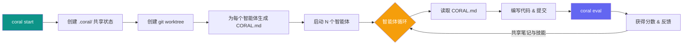

<div align="center">


# CORAL

### **启动智能体，共享知识，永不停歇地优化。**

一套面向**自主编程智能体**的编排系统 ——
智能体运行实验、共享知识、循环迭代，直到收敛到最优解。

[](LICENSE)
[](https://python.org)
[](https://docs.astral.sh/uv/)

[English](README.md) | **中文**

</div>

---

## 🚀 一份配置，N 个智能体，持续刷新 SOTA。

```bash
git clone https://github.com/Human-Agent-Society/CORAL.git && cd CORAL && uv sync
coral start --config task.yaml
```

## ⏹️ 随时暂停，随时恢复。

```bash
coral stop                                             # 随时停止
coral resume                                           # 从中断处继续
```

---

## 工作原理



每个智能体在独立的 git worktree 中工作，通过 `.coral/` 共享知识，自主循环 —— 编码、评估、改进，直到收敛。

---

## 核心概念

| 概念 | 说明 |
|------|------|
| **智能体即优化器** | Claude Code / Codex / OpenCode 子进程，各自运行在独立的 git worktree 中 |
| **共享状态** | `.coral/` 目录包含尝试记录、笔记和技能 —— 通过符号链接同步到每个 worktree |
| **评估循环** | 智能体调用 `coral eval -m "..."` 一步完成暂存、提交和评分 |
| **CLI 编排** | 17+ 个命令：`start`、`stop`、`status`、`eval`、`log`、`ui` 等 |
| **Web 仪表盘** | `coral ui` —— 实时排行榜、尝试记录对比、智能体监控 |

---

## 快速开始

### 1. 安装

```bash
git clone https://github.com/Human-Agent-Society/CORAL.git
cd CORAL
uv sync                    # 基础安装
uv sync --extra dev        # 包含 pytest, ruff, mypy
uv sync --all-extras       # 安装所有依赖
```

### 2. 创建任务

```yaml
# my-task/task.yaml
task:
  name: my-task
  description: "优化 solution.py 中的函数"

grader:
  type: function
  module: eval.grader

agents:
  count: 2
  model: claude-sonnet-4-20250514
  max_turns: 200
```

### 3. 编写评分器

```python
# my-task/eval/grader.py
from coral.grader import TaskGrader

class Grader(TaskGrader):
    def evaluate(self) -> float:
        result = self.run_program("solution.py")
        return float(result.stdout.strip())
```

### 4. 启动

```bash
coral start --config my-task/task.yaml
coral ui          # 打开 Web 仪表盘
coral status      # CLI 排行榜
coral log         # 查看尝试记录
coral stop        # 停止所有智能体
```

---

## CLI 命令参考

| 命令 | 说明 |
|------|------|
| `coral init <name>` | 初始化新任务 |
| `coral validate <name>` | 测试评分器 |
| `coral start -c task.yaml` | 启动智能体 |
| `coral resume` | 恢复之前的运行 |
| `coral stop` | 停止所有智能体 |
| `coral status` | 智能体状态 + 排行榜 |
| `coral log` | 排行榜（前 20） |
| `coral log -n 5 --recent` | 最近的尝试记录 |
| `coral log --search "关键词"` | 搜索尝试记录 |
| `coral show <hash>` | 尝试详情 + diff |
| `coral notes` | 浏览共享笔记 |
| `coral skills` | 浏览共享技能 |
| `coral runs` | 列出所有运行 |
| `coral ui` | Web 仪表盘 |
| `coral eval -m "描述"` | 暂存、提交、评估（智能体调用） |
| `coral diff` | 查看未提交的变更 |
| `coral revert` | 撤销上次提交 |
| `coral checkout <hash>` | 重置到之前的尝试 |
| `coral heartbeat` | 查看/修改心跳动作 |

---

## 评分系统

评分器实现 `GraderInterface` 协议：

```python
class GraderInterface(Protocol):
    async def grade(self, codebase_path: str, tasks: list[Task], **kwargs) -> ScoreBundle: ...
```

内置评分器：

| 评分器 | 用途 |
|--------|------|
| **TaskGrader** | 任务评分器基类 —— 提供 `run_program`、`read_eval`、`score`、`fail` 等辅助方法 |
| **FunctionGrader** | 将任意 `(codebase_path, tasks) -> Score | float | bool` 可调用对象封装为评分器 |

---

## 项目结构

```
coral/
├── types.py             # Task, Score, ScoreBundle, Attempt
├── config.py            # 基于 YAML 的 CoralConfig
├── agent/
│   ├── manager.py       # 多智能体生命周期管理
│   └── runtime.py       # Claude Code / Codex / OpenCode 子进程
├── workspace/
│   └── setup.py         # Worktree 创建、钩子、符号链接
├── grader/
│   ├── protocol.py      # GraderInterface 协议
│   ├── base.py          # BaseGrader（辅助方法：_make_score, _make_bundle）
│   ├── task_grader.py   # TaskGrader 任务评分器基类
│   ├── loader.py        # 评分器发现与加载
│   └── builtin/
│       └── function_grader.py
├── hub/
│   ├── attempts.py      # 尝试记录 CRUD + 排行榜 + 搜索
│   ├── notes.py         # Markdown 笔记（YAML frontmatter）
│   └── skills.py        # 技能目录（含 SKILL.md）
├── hooks/
│   └── post_commit.py   # 提交后评估实现
├── template/
│   └── coral_md.py      # CORAL.md 生成器
├── web/                 # Starlette + React 仪表盘
└── cli/                 # 5 个模块，17 个命令
```

---

## 示例

`examples/` 目录中包含可直接运行的任务配置：

| 任务 | 领域 | 说明 |
|------|------|------|
| **circle_packing** | 优化 | 将 26 个圆填入单位正方形，最大化半径之和 |
| **erdos** | 数学 | 求解数学猜想 |
| **kernel_builder** | 系统 | VLIW SIMD 内核优化 |
| **kernel_engineering** | 系统 | GPU 内核优化 |
| **mnist** | 机器学习 | 手写数字分类 |
| **spaceship_titanic** | 机器学习 | Kaggle 竞赛 |
| **stanford_covid_vaccine** | 生物/ML | mRNA 降解预测 |

---

## 技术栈

| 组件 | 技术 |
|------|------|
| 语言 | Python 3.11+ |
| 构建 | Hatchling |
| 包管理 | uv |
| Web 后端 | Starlette |
| Web 前端 | React + TypeScript (Vite) |
| 核心依赖 | PyYAML |
| 可选依赖 | swebench, datasets, docker, harbor |

---

## 开发

```bash
# 安装开发依赖
uv sync --extra dev

# 运行测试
uv run pytest tests/ -v

# 代码检查与格式化
uv run ruff check .
uv run ruff format .
```

---

## 许可证

MIT —— 详见 [LICENSE](LICENSE)。
